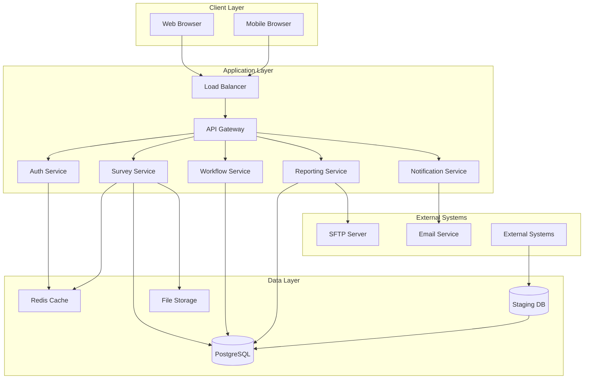

# CHC Insight CRM - Design Document

## Overview

CHC Insight is a comprehensive, multi-tenant CRM application designed for Long-Term Services and Supports (LTSS) business within Managed Care Organization (MCO) environments. The system captures survey/assessment data to meet state requirements while tracking member, provider, and internal performance metrics. Built on a modern three-tier architecture with React-based frontend, Node.js/Express backend, and PostgreSQL database, the system features a dynamic survey engine, workflow management, role-based access control, and comprehensive reporting capabilities to support healthcare compliance and quality management while handling high-volume operations and maintaining HIPAA compliance.

## Architecture

### High-Level Architecture



### Technology Stack

**Frontend:** 
- React 18 with TypeScript
- Next.js 14 with App Router
- Component libraries: shadcn/ui with modern oklch color system
- Styling: Tailwind CSS v3 with PostCSS
- Form handling: TanStack Form (v0.29.0) with Zod validation
- State Management: TanStack Query for server state and caching
- Router: TanStack Router for type-safe navigation
- Charts: Recharts with shadcn chart components
- Icons: Lucide React
- Animation: CSS transitions and transforms (Framer Motion optional)
- Data Tables: TanStack Table with shadcn table components

**Modern Frontend Architecture**
```
/src
  /app                    # Next.js 14 app directory
    /layout.tsx          # Root layout with providers
    /page.tsx            # Landing page
    /dashboard/          # Dashboard routes
      /layout.tsx        # Dashboard layout with sidebar
      /page.tsx          # Overview dashboard
      /surveys/          # Survey management
      /reports/          # Reporting interface
      /admin/            # Administration
  /components
    /ui/                 # shadcn/ui base components
    /charts/             # Chart compositions using Recharts
    /features/           # Feature-specific components
      /survey-builder/   # Survey creation interface
      /survey-execution/ # Survey form renderer
      /work-queue/       # Task management
      /dashboard/        # Dashboard widgets
    /providers.tsx       # TanStack Query provider setup
  /lib
    /api.ts              # API client with fetch wrapper
    /utils.ts            # Utility functions (cn, etc.)
    /validations/        # Zod schemas for forms
  /hooks
    /useAuth.ts          # Authentication hooks
    /useSurveys.ts       # Survey-related hooks
    /useWorkQueue.ts     # Work queue hooks
  /types
    /index.ts            # TypeScript type definitions
```

**Key Frontend Patterns**
- **Type Safety**: Full TypeScript coverage with Zod validation schemas
- **Modern Color System**: oklch color space for better accessibility and consistency
- **Composition Pattern**: Build complex UIs by composing shadcn primitives
- **Server Components**: Leverage Next.js 14 for performance on data-heavy pages
- **Client Components**: Use 'use client' directive for interactive components
- **Custom Hooks**: Encapsulate business logic in reusable hooks
- **API Integration**: TanStack Query for caching, background updates, and optimistic updates

**Performance Optimizations**
- Code splitting with Next.js dynamic imports
- Image optimization with Next.js Image component
- Lazy loading for chart components and heavy widgets
- Proper memoization with React.memo and useMemo
- Efficient re-renders with TanStack Query's stale-while-revalidate pattern

**Modern Development Patterns**
```typescript
// Custom hooks for business logic
export const useAutoSave = (data: any, saveFn: Function, options: { delay: number }) => {
  const debouncedData = useDebounce(data, options.delay)
  
  useEffect(() => {
    if (debouncedData) {
      saveFn(debouncedData)
    }
  }, [debouncedData, saveFn])
}

// Optimistic updates with TanStack Query
export const useUpdateSurvey = () => {
  const queryClient = useQueryClient()
  
  return useMutation({
    mutationFn: updateSurvey,
    onMutate: async (newSurvey) => {
      await queryClient.cancelQueries({ queryKey: ['surveys'] })
      const previousSurveys = queryClient.getQueryData(['surveys'])
      queryClient.setQueryData(['surveys'], (old: Survey[]) => 
        old.map(survey => survey.id === newSurvey.id ? newSurvey : survey)
      )
      return { previousSurveys }
    },
    onError: (err, newSurvey, context) => {
      queryClient.setQueryData(['surveys'], context?.previousSurveys)
    },
    onSettled: () => {
      queryClient.invalidateQueries({ queryKey: ['surveys'] })
    },
  })
}

// Form validation with Zod
export const surveyTemplateSchema = z.object({
  name: z.string().min(1, 'Name is required').max(255),
  description: z.string().optional(),
  questions: z.array(questionSchema).min(1, 'At least one question is required'),
  businessRules: z.array(businessRuleSchema).optional(),
})

// Responsive design with Tailwind
const ResponsiveLayout = ({ children }: { children: React.ReactNode }) => (
  <div className="grid grid-cols-1 md:grid-cols-2 lg:grid-cols-3 xl:grid-cols-4 gap-4 p-4">
    {children}
  </div>
)
```

**Accessibility and UX Enhancements**
- ARIA labels and roles for screen readers
- Keyboard navigation support for all interactive elements
- Focus management for modals and complex forms
- Loading states and skeleton components for better perceived performance
- Error boundaries for graceful error handling
- Toast notifications for user feedback

**Backend:**
- Node.js with Express.js framework
- TypeScript for type safety
- JWT for authentication
- Passport.js for OAuth integration
- Bull Queue for background job processing
- Winston for logging

**Database:**
- PostgreSQL 14+ for primary data storage
- Redis for caching and session management
- File system storage for attachments

**Infrastructure:**
- Docker containers for deployment
- NGINX for reverse proxy and load balancing
- PM2 for process management
- Monitoring with Prometheus/Grafana

## Components and Interfaces

### Role-Based Access Control

#### User Roles and Permissions
```typescript
enum UserRole {
  ADMINISTRATOR = 'administrator',
  SERVICE_COORDINATOR = 'service_coordinator',
  UM_NURSE = 'um_nurse',
  QM_STAFF = 'qm_staff',
  COMMUNICATIONS_TEAM = 'communications_team',
  MANAGER = 'manager'
}

interface RolePermissions {
  [UserRole.ADMINISTRATOR]: {
    surveys: ['create', 'read', 'update', 'delete', 'assign', 'approve']
    users: ['create', 'read', 'update', 'delete', 'manage_roles']
    reports: ['create', 'read', 'schedule', 'export']
    system: ['configure', 'monitor', 'audit']
  }
  [UserRole.SERVICE_COORDINATOR]: {
    surveys: ['create', 'read', 'update', 'submit']
    members: ['read', 'search']
    providers: ['read', 'search']
    reports: ['read', 'export']
  }
  [UserRole.MANAGER]: {
    surveys: ['read', 'approve', 'assign', 'reassign']
    reports: ['create', 'read', 'schedule', 'export']
    team: ['view_performance', 'manage_workload']
  }
  // Additional role definitions...
}

interface AccessControlService {
  checkPermission(userId: string, resource: string, action: string): Promise<boolean>
  getAssignmentRules(userId: string): Promise<AssignmentRule[]>
  enforceTeamVisibility(userId: string, surveyId: string): Promise<boolean>
  validateDataAccess(userId: string, tenantId: string): Promise<boolean>
}
```

### Core Services

#### 1. Authentication Service
```typescript
interface AuthService {
  authenticate(credentials: LoginCredentials): Promise<AuthResult>
  validateToken(token: string): Promise<UserContext>
  refreshToken(refreshToken: string): Promise<TokenPair>
  logout(userId: string): Promise<void>
  resetPassword(email: string): Promise<void>
}

interface UserContext {
  userId: string
  tenantId: string
  roles: Role[]
  permissions: Permission[]
  sessionId: string
}
```

#### 2. Survey Service
```typescript
interface SurveyService {
  createTemplate(template: SurveyTemplate): Promise<SurveyTemplate>
  updateTemplate(id: string, template: Partial<SurveyTemplate>): Promise<SurveyTemplate>
  getTemplate(id: string, version?: number): Promise<SurveyTemplate>
  copyTemplate(id: string, newName: string): Promise<SurveyTemplate>
  previewTemplate(template: SurveyTemplate): Promise<SurveyPreview>
  createInstance(templateId: string, context: SurveyContext): Promise<SurveyInstance>
  saveResponse(instanceId: string, responses: ResponseData[], isDraft?: boolean): Promise<SurveyInstance>
  submitSurvey(instanceId: string): Promise<SurveyInstance>
  validateResponses(responses: ResponseData[]): Promise<ValidationResult>
  checkDuplicates(memberId: string, templateId: string): Promise<DuplicateCheckResult>
  autoPopulateData(memberId: string, providerId?: string): Promise<PrePopulationData>
  searchMembers(query: string): Promise<Member[]>
  searchProviders(query: string): Promise<Provider[]>
}

interface SurveyTemplate {
  id: string
  name: string
  description?: string
  type: SurveyType // initial_assessment, reassessment, provider_survey, incident_report, satisfaction_survey, custom
  version: number
  tenantId: string
  questions: Question[]
  businessRules: BusinessRule[]
  workflow: WorkflowConfig
  isActive: boolean
  effectiveDate: Date
  expirationDate?: Date
  createdBy: string
  dueDateCalculation?: DueDateRule
  reminderFrequency?: ReminderConfig
  autoAssignmentRules?: AssignmentRule[]
}

interface Question {
  id: string
  type: QuestionType // text_input, numeric_input, date, datetime, single_select, multi_select, yes_no, file_upload, section_header
  text: string
  required: boolean
  validation: ValidationRule[]
  conditionalLogic?: ConditionalRule[]
  options?: QuestionOption[]
  defaultValue?: any
  helpText?: string
  prePopulationMapping?: string // maps to staging table field
}

enum SurveyType {
  INITIAL_ASSESSMENT = 'initial_assessment',
  REASSESSMENT = 'reassessment',
  PROVIDER_SURVEY = 'provider_survey',
  INCIDENT_REPORT = 'incident_report',
  SATISFACTION_SURVEY = 'satisfaction_survey',
  CUSTOM = 'custom'
}

interface PrePopulationData {
  memberData?: {
    firstName: string
    lastName: string
    dateOfBirth: Date
    planType: string
    ltssType: string
    levelOfCare: string
    picsScore: number
    assignedCoordinator: string
  }
  providerData?: {
    npi: string
    name: string
    specialty: string
    networkStatus: string
    contactInfo: ContactInfo
  }
  priorAssessments?: SurveyInstance[]
}
```

#### 3. Workflow Service
```typescript
interface WorkflowService {
  startWorkflow(surveyId: string, workflowType: string): Promise<WorkflowInstance>
  processTask(taskId: string, action: WorkflowAction): Promise<WorkflowInstance>
  assignTask(taskId: string, assigneeId: string): Promise<void>
  escalateTask(taskId: string): Promise<void>
  getWorkQueue(userId: string, filters?: WorkQueueFilters): Promise<WorkTask[]>
  sendNotification(notification: NotificationRequest): Promise<void>
}

interface WorkflowInstance {
  id: string
  surveyId: string
  currentState: WorkflowState
  tasks: WorkTask[]
  history: WorkflowHistory[]
  dueDate: Date
  priority: Priority
}
```

#### 4. Reporting Service
```typescript
interface ReportingService {
  generateReport(reportConfig: ReportConfig): Promise<ReportResult>
  scheduleReport(schedule: ReportSchedule): Promise<string>
  exportData(exportConfig: ExportConfig): Promise<ExportResult>
  getDashboardData(dashboardId: string, filters?: DashboardFilters): Promise<DashboardData>
  getAnalytics(analyticsQuery: AnalyticsQuery): Promise<AnalyticsResult>
  getPreBuiltReports(): Promise<ReportTemplate[]>
  createCustomReport(config: CustomReportConfig): Promise<ReportTemplate>
  getPerformanceMetrics(userId?: string, dateRange?: DateRange): Promise<PerformanceMetrics>
}

interface ReportConfig {
  templateId: string
  parameters: ReportParameter[]
  filters: ReportFilter[]
  format: ExportFormat // excel, csv, pdf, state_specific
  dateRange: DateRange
  groupBy?: string[]
  columns?: string[]
}

interface PerformanceMetrics {
  staffMetrics: {
    userId: string
    surveysCompleted: number
    averageCompletionTime: number
    productivityTrend: TrendData[]
  }[]
  qualityMetrics: {
    rejectionRate: number
    resubmissionFrequency: number
    approvalTurnaroundTime: number
  }
  usageMetrics: {
    activeUsersByRole: Record<string, number>
    peakUsageTimes: TimeSlot[]
    surveyTypePopularity: Record<string, number>
  }
  systemMetrics: {
    errorRate: number
    systemExceptions: number
  }
}
```

### Frontend Components

#### 1. Survey Builder (Modern Implementation)
```typescript
'use client'

import { useForm } from '@tanstack/react-form'
import { zodValidator } from '@tanstack/zod-form-adapter'
import { DndContext, DragEndEvent } from '@dnd-kit/core'
import { SortableContext, verticalListSortingStrategy } from '@dnd-kit/sortable'

interface SurveyBuilderProps {
  template?: SurveyTemplate
  onSave: (template: SurveyTemplate) => void
  onPreview: (template: SurveyTemplate) => void
}

const SurveyBuilder: React.FC<SurveyBuilderProps> = ({ template, onSave, onPreview }) => {
  const form = useForm({
    defaultValues: template || createEmptyTemplate(),
    onSubmit: async ({ value }) => onSave(value),
    validatorAdapter: zodValidator,
  })

  return (
    <div className="grid grid-cols-12 gap-6 h-screen">
      <QuestionTypeLibrary className="col-span-3" />
      <DndContext onDragEnd={handleDragEnd}>
        <SurveyCanvas className="col-span-6" form={form} />
      </DndContext>
      <QuestionProperties className="col-span-3" />
    </div>
  )
}

interface QuestionTypeLibrary {
  textInput: { icon: LucideIcon; label: string; type: QuestionType }
  numericInput: { icon: LucideIcon; label: string; type: QuestionType }
  dateInput: { icon: LucideIcon; label: string; type: QuestionType }
  singleSelect: { icon: LucideIcon; label: string; type: QuestionType }
  multiSelect: { icon: LucideIcon; label: string; type: QuestionType }
  yesNo: { icon: LucideIcon; label: string; type: QuestionType }
  fileUpload: { icon: LucideIcon; label: string; type: QuestionType }
  sectionHeader: { icon: LucideIcon; label: string; type: QuestionType }
}
```

#### 2. Survey Execution (TanStack Form Integration)
```typescript
'use client'

import { useForm } from '@tanstack/react-form'
import { useMutation, useQuery } from '@tanstack/react-query'
import { useAutoSave } from '@/hooks/useAutoSave'

interface SurveyExecutionProps {
  instanceId: string
  readonly?: boolean
}

const SurveyExecution: React.FC<SurveyExecutionProps> = ({ instanceId, readonly }) => {
  const { data: instance } = useQuery({
    queryKey: ['survey-instance', instanceId],
    queryFn: () => surveyApi.getInstance(instanceId),
  })

  const { mutate: saveResponse } = useMutation({
    mutationFn: (data: ResponseData[]) => surveyApi.saveResponse(instanceId, data),
  })

  const form = useForm({
    defaultValues: instance?.responseData || {},
    onSubmit: async ({ value }) => {
      await surveyApi.submitSurvey(instanceId, value)
    },
  })

  useAutoSave(form.state.values, saveResponse, { delay: 2000 })

  return (
    <Card className="max-w-4xl mx-auto">
      <CardHeader>
        <CardTitle>{instance?.template.name}</CardTitle>
        <ProgressIndicator current={getCurrentStep()} total={getTotalSteps()} />
      </CardHeader>
      <CardContent>
        <DynamicFormRenderer 
          template={instance?.template} 
          form={form}
          readonly={readonly}
        />
      </CardContent>
    </Card>
  )
}

interface ConditionalLogicEngine {
  evaluateConditions(responses: ResponseData[], rules: ConditionalRule[]): boolean
  getVisibleQuestions(template: SurveyTemplate, responses: ResponseData[]): Question[]
  updateFormState(form: FormApi<any>, conditions: ConditionalRule[]): void
}
```

#### 3. Modern Dashboard Components
```typescript
'use client'

import { Suspense } from 'react'
import { useQuery } from '@tanstack/react-query'
import { Card, CardContent, CardHeader, CardTitle } from '@/components/ui/card'
import { ChartContainer, ChartTooltip } from '@/components/ui/chart'
import { AreaChart, BarChart, LineChart } from 'recharts'

interface DashboardProps {
  userId: string
  role: UserRole
  tenantId: string
}

const Dashboard: React.FC<DashboardProps> = ({ userId, role, tenantId }) => {
  return (
    <div className="space-y-6">
      <DashboardHeader role={role} />
      <div className="grid grid-cols-1 md:grid-cols-2 lg:grid-cols-4 gap-6">
        <Suspense fallback={<MetricCardSkeleton />}>
          <MetricCards role={role} />
        </Suspense>
      </div>
      <div className="grid grid-cols-1 lg:grid-cols-2 gap-6">
        <Suspense fallback={<ChartSkeleton />}>
          <ComplianceChart />
          <ProductivityChart />
        </Suspense>
      </div>
    </div>
  )
}

const ComplianceChart: React.FC = () => {
  const { data } = useQuery({
    queryKey: ['dashboard', 'compliance'],
    queryFn: () => dashboardApi.getComplianceData(),
  })

  return (
    <Card>
      <CardHeader>
        <CardTitle>Compliance Rates</CardTitle>
      </CardHeader>
      <CardContent>
        <ChartContainer config={complianceChartConfig}>
          <AreaChart data={data}>
            <ChartTooltip />
            {/* Chart implementation */}
          </AreaChart>
        </ChartContainer>
      </CardContent>
    </Card>
  )
}
```

#### 4. Work Queue with TanStack Table
```typescript
'use client'

import { useQuery } from '@tanstack/react-query'
import { useReactTable, getCoreRowModel, getFilteredRowModel } from '@tanstack/react-table'
import { DataTable } from '@/components/ui/data-table'
import { Badge } from '@/components/ui/badge'

interface WorkQueueProps {
  userId: string
  role: UserRole
  filters?: WorkQueueFilters
}

const WorkQueue: React.FC<WorkQueueProps> = ({ userId, role, filters }) => {
  const { data: tasks } = useQuery({
    queryKey: ['work-queue', userId, filters],
    queryFn: () => workQueueApi.getTasks(userId, filters),
  })

  const columns = useMemo(() => [
    {
      accessorKey: 'surveyName',
      header: 'Survey',
    },
    {
      accessorKey: 'memberName',
      header: 'Member',
    },
    {
      accessorKey: 'status',
      header: 'Status',
      cell: ({ row }) => (
        <Badge variant={getStatusVariant(row.original.status)}>
          {row.original.status}
        </Badge>
      ),
    },
    {
      accessorKey: 'dueDate',
      header: 'Due Date',
      cell: ({ row }) => (
        <span className={getDueDateClass(row.original.dueDate)}>
          {formatDate(row.original.dueDate)}
        </span>
      ),
    },
  ], [])

  const table = useReactTable({
    data: tasks || [],
    columns,
    getCoreRowModel: getCoreRowModel(),
    getFilteredRowModel: getFilteredRowModel(),
  })

  return (
    <Card>
      <CardHeader>
        <CardTitle>Work Queue</CardTitle>
        <WorkQueueFilters onFiltersChange={setFilters} />
      </CardHeader>
      <CardContent>
        <DataTable table={table} />
      </CardContent>
    </Card>
  )
}
```

#### 5. Enhanced Search Components
```typescript
'use client'

import { useState, useMemo } from 'react'
import { useQuery } from '@tanstack/react-query'
import { Command, CommandInput, CommandList, CommandItem } from '@/components/ui/command'
import { Popover, PopoverContent, PopoverTrigger } from '@/components/ui/popover'
import { useDebounce } from '@/hooks/useDebounce'

interface SearchComponentProps {
  onSelect: (item: Member | Provider) => void
  searchType: 'member' | 'provider'
  placeholder?: string
  value?: string
}

const SearchComponent: React.FC<SearchComponentProps> = ({ 
  onSelect, 
  searchType, 
  placeholder,
  value 
}) => {
  const [query, setQuery] = useState('')
  const [open, setOpen] = useState(false)
  const debouncedQuery = useDebounce(query, 300)

  const { data: results } = useQuery({
    queryKey: [searchType, 'search', debouncedQuery],
    queryFn: () => searchApi.search(searchType, debouncedQuery),
    enabled: debouncedQuery.length >= 2,
  })

  return (
    <Popover open={open} onOpenChange={setOpen}>
      <PopoverTrigger asChild>
        <Button variant="outline" className="justify-start">
          {value || placeholder || `Search ${searchType}...`}
        </Button>
      </PopoverTrigger>
      <PopoverContent className="p-0" align="start">
        <Command>
          <CommandInput 
            placeholder={placeholder} 
            value={query}
            onValueChange={setQuery}
          />
          <CommandList>
            {results?.map((item) => (
              <CommandItem
                key={item.id}
                onSelect={() => {
                  onSelect(item)
                  setOpen(false)
                }}
              >
                <SearchResultItem item={item} type={searchType} />
              </CommandItem>
            ))}
          </CommandList>
        </Command>
      </PopoverContent>
    </Popover>
  )
}
```

## Data Models

### Core Entities

#### Survey Template
```sql
CREATE TABLE survey_templates (
    id UUID PRIMARY KEY DEFAULT gen_random_uuid(),
    tenant_id UUID NOT NULL REFERENCES tenants(id),
    name VARCHAR(255) NOT NULL,
    description TEXT,
    version INTEGER NOT NULL DEFAULT 1,
    template_data JSONB NOT NULL,
    workflow_config JSONB,
    business_rules JSONB,
    is_active BOOLEAN DEFAULT true,
    effective_date TIMESTAMP NOT NULL,
    expiration_date TIMESTAMP,
    created_by UUID NOT NULL REFERENCES users(id),
    created_at TIMESTAMP DEFAULT CURRENT_TIMESTAMP,
    updated_at TIMESTAMP DEFAULT CURRENT_TIMESTAMP
);
```

#### Survey Instance
```sql
CREATE TABLE survey_instances (
    id UUID PRIMARY KEY DEFAULT gen_random_uuid(),
    template_id UUID NOT NULL REFERENCES survey_templates(id),
    tenant_id UUID NOT NULL REFERENCES tenants(id),
    member_id VARCHAR(50),
    provider_id VARCHAR(50),
    assigned_to UUID REFERENCES users(id),
    status survey_status NOT NULL DEFAULT 'draft',
    response_data JSONB,
    context_data JSONB,
    due_date TIMESTAMP,
    submitted_at TIMESTAMP,
    approved_at TIMESTAMP,
    created_at TIMESTAMP DEFAULT CURRENT_TIMESTAMP,
    updated_at TIMESTAMP DEFAULT CURRENT_TIMESTAMP
);
```

#### Workflow Instance
```sql
CREATE TABLE workflow_instances (
    id UUID PRIMARY KEY DEFAULT gen_random_uuid(),
    survey_id UUID NOT NULL REFERENCES survey_instances(id),
    workflow_type VARCHAR(100) NOT NULL,
    current_state VARCHAR(100) NOT NULL,
    state_data JSONB,
    due_date TIMESTAMP,
    priority INTEGER DEFAULT 3,
    created_at TIMESTAMP DEFAULT CURRENT_TIMESTAMP,
    updated_at TIMESTAMP DEFAULT CURRENT_TIMESTAMP
);
```

#### Users and Roles
```sql
CREATE TABLE users (
    id UUID PRIMARY KEY DEFAULT gen_random_uuid(),
    tenant_id UUID NOT NULL REFERENCES tenants(id),
    email VARCHAR(255) UNIQUE NOT NULL,
    password_hash VARCHAR(255) NOT NULL,
    first_name VARCHAR(100) NOT NULL,
    last_name VARCHAR(100) NOT NULL,
    is_active BOOLEAN DEFAULT true,
    last_login TIMESTAMP,
    region VARCHAR(100),
    member_panel JSONB, -- Array of member IDs or criteria
    provider_network JSONB, -- Array of provider IDs or network criteria
    created_at TIMESTAMP DEFAULT CURRENT_TIMESTAMP
);

CREATE TABLE roles (
    id UUID PRIMARY KEY DEFAULT gen_random_uuid(),
    tenant_id UUID NOT NULL REFERENCES tenants(id),
    name VARCHAR(100) NOT NULL,
    description TEXT,
    permissions JSONB NOT NULL
);

CREATE TABLE user_roles (
    user_id UUID NOT NULL REFERENCES users(id),
    role_id UUID NOT NULL REFERENCES roles(id),
    assigned_at TIMESTAMP DEFAULT CURRENT_TIMESTAMP,
    PRIMARY KEY (user_id, role_id)
);

-- Assignment rules for automatic survey routing
CREATE TABLE assignment_rules (
    id UUID PRIMARY KEY DEFAULT gen_random_uuid(),
    tenant_id UUID NOT NULL REFERENCES tenants(id),
    rule_name VARCHAR(255) NOT NULL,
    survey_type VARCHAR(100),
    criteria JSONB NOT NULL, -- Region, member panel, provider network criteria
    assigned_role VARCHAR(100),
    assigned_user_id UUID REFERENCES users(id),
    priority INTEGER DEFAULT 1,
    is_active BOOLEAN DEFAULT true
);
```

### Multi-Tenant Architecture

#### Tenant Isolation
```sql
CREATE TABLE tenants (
    id UUID PRIMARY KEY DEFAULT gen_random_uuid(),
    name VARCHAR(255) NOT NULL,
    subdomain VARCHAR(100) UNIQUE,
    configuration JSONB,
    is_active BOOLEAN DEFAULT true,
    created_at TIMESTAMP DEFAULT CURRENT_TIMESTAMP
);

-- Row-level security for tenant isolation
CREATE POLICY tenant_isolation ON survey_instances
    USING (tenant_id = current_setting('app.current_tenant')::UUID);
```

### Data Architecture and Temporal Management

#### Flexible Schema Design
```sql
-- EAV model for dynamic survey questions
CREATE TABLE survey_question_definitions (
    id UUID PRIMARY KEY DEFAULT gen_random_uuid(),
    template_id UUID NOT NULL REFERENCES survey_templates(id),
    question_key VARCHAR(255) NOT NULL,
    question_config JSONB NOT NULL,
    created_at TIMESTAMP DEFAULT CURRENT_TIMESTAMP
);

CREATE TABLE survey_response_values (
    id UUID PRIMARY KEY DEFAULT gen_random_uuid(),
    instance_id UUID NOT NULL REFERENCES survey_instances(id),
    question_key VARCHAR(255) NOT NULL,
    response_value JSONB,
    response_metadata JSONB,
    created_at TIMESTAMP DEFAULT CURRENT_TIMESTAMP,
    updated_at TIMESTAMP DEFAULT CURRENT_TIMESTAMP
);

-- Version history tracking
CREATE TABLE survey_template_history (
    id UUID PRIMARY KEY DEFAULT gen_random_uuid(),
    template_id UUID NOT NULL REFERENCES survey_templates(id),
    version_number INTEGER NOT NULL,
    template_data JSONB NOT NULL,
    change_summary TEXT,
    changed_by UUID NOT NULL REFERENCES users(id),
    created_at TIMESTAMP DEFAULT CURRENT_TIMESTAMP
);

-- Response change tracking for audit trails
CREATE TABLE survey_response_history (
    id UUID PRIMARY KEY DEFAULT gen_random_uuid(),
    instance_id UUID NOT NULL REFERENCES survey_instances(id),
    question_key VARCHAR(255) NOT NULL,
    old_value JSONB,
    new_value JSONB,
    changed_by UUID NOT NULL REFERENCES users(id),
    change_reason TEXT,
    created_at TIMESTAMP DEFAULT CURRENT_TIMESTAMP
);
```

#### Full-Text Search Implementation
```sql
-- Full-text search indexes
CREATE INDEX idx_survey_responses_fulltext ON survey_instances 
USING gin(to_tsvector('english', response_data::text));

CREATE INDEX idx_member_search ON staging_members 
USING gin(to_tsvector('english', first_name || ' ' || last_name));

CREATE INDEX idx_provider_search ON staging_providers 
USING gin(to_tsvector('english', name || ' ' || specialty));
```

#### Data Quality and Integrity
```sql
-- Referential integrity constraints
ALTER TABLE survey_instances 
ADD CONSTRAINT fk_survey_template_active 
CHECK (EXISTS (
    SELECT 1 FROM survey_templates st 
    WHERE st.id = template_id AND st.is_active = true
));

-- Duplicate detection
CREATE UNIQUE INDEX idx_survey_duplicate_prevention 
ON survey_instances(template_id, member_id, provider_id, tenant_id) 
WHERE status != 'cancelled';

-- Data validation at database level
ALTER TABLE survey_instances 
ADD CONSTRAINT chk_valid_status 
CHECK (status IN ('draft', 'pending', 'approved', 'rejected', 'completed', 'cancelled'));
```

### Staging Data Integration

#### Member Data
```sql
CREATE TABLE staging_members (
    member_id VARCHAR(50) PRIMARY KEY,
    tenant_id UUID NOT NULL,
    first_name VARCHAR(100),
    last_name VARCHAR(100),
    date_of_birth DATE,
    plan_type VARCHAR(50),
    ltss_type VARCHAR(50),
    level_of_care VARCHAR(50),
    pics_score INTEGER,
    assigned_coordinator_id UUID,
    last_updated TIMESTAMP DEFAULT CURRENT_TIMESTAMP,
    -- Full-text search support
    search_vector tsvector GENERATED ALWAYS AS (
        to_tsvector('english', first_name || ' ' || last_name || ' ' || member_id)
    ) STORED
);

CREATE INDEX idx_staging_members_search ON staging_members USING gin(search_vector);
```

#### Provider Data
```sql
CREATE TABLE staging_providers (
    provider_id VARCHAR(50) PRIMARY KEY,
    tenant_id UUID NOT NULL,
    npi VARCHAR(20),
    name VARCHAR(255),
    specialty VARCHAR(100),
    network_status VARCHAR(50),
    address JSONB,
    contact_info JSONB,
    last_updated TIMESTAMP DEFAULT CURRENT_TIMESTAMP,
    -- Full-text search support
    search_vector tsvector GENERATED ALWAYS AS (
        to_tsvector('english', name || ' ' || specialty || ' ' || npi)
    ) STORED
);

CREATE INDEX idx_staging_providers_search ON staging_providers USING gin(search_vector);
```

## Error Handling

### API Error Response Format
```typescript
interface ApiError {
  code: string
  message: string
  details?: any
  timestamp: string
  requestId: string
}

// Standard HTTP status codes
enum ErrorCodes {
  VALIDATION_ERROR = 'VALIDATION_ERROR',
  UNAUTHORIZED = 'UNAUTHORIZED',
  FORBIDDEN = 'FORBIDDEN',
  NOT_FOUND = 'NOT_FOUND',
  DUPLICATE_SURVEY = 'DUPLICATE_SURVEY',
  WORKFLOW_ERROR = 'WORKFLOW_ERROR',
  INTEGRATION_ERROR = 'INTEGRATION_ERROR'
}
```

### Error Handling Strategy
1. **Client-side validation** for immediate feedback
2. **Server-side validation** for data integrity
3. **Graceful degradation** for non-critical features
4. **Retry mechanisms** for transient failures
5. **Comprehensive logging** for debugging and monitoring

### Business Rule Validation
```typescript
interface ValidationRule {
  type: 'required' | 'format' | 'range' | 'custom'
  parameters: any
  errorMessage: string
}

interface BusinessRuleEngine {
  validateSurvey(survey: SurveyInstance, rules: BusinessRule[]): ValidationResult
  validateWorkflow(workflow: WorkflowInstance): ValidationResult
  validateUserAccess(user: UserContext, resource: string): boolean
}
```

## Testing Strategy

### Unit Testing
- **Backend**: Jest with supertest for API testing
- **Frontend**: Jest with React Testing Library
- **Database**: Test containers with PostgreSQL
- **Coverage target**: 80% code coverage

### Integration Testing
- **API endpoints** with real database connections
- **Workflow processes** end-to-end
- **Authentication flows** including OAuth
- **File upload/download** functionality

### End-to-End Testing
- **Cypress** for critical user journeys
- **Survey creation and execution** workflows
- **Multi-tenant isolation** verification
- **Performance testing** with realistic data volumes

### Security Testing
- **OWASP ZAP** for vulnerability scanning
- **SQL injection** prevention testing
- **Authentication bypass** attempts
- **Data access control** verification

## Performance Considerations

### Database Optimization
```sql
-- Indexes for common queries
CREATE INDEX idx_survey_instances_tenant_status ON survey_instances(tenant_id, status);
CREATE INDEX idx_survey_instances_assigned_to ON survey_instances(assigned_to) WHERE status IN ('draft', 'pending');
CREATE INDEX idx_workflow_instances_due_date ON workflow_instances(due_date) WHERE current_state != 'completed';

-- Partitioning for large tables
CREATE TABLE survey_responses_y2024 PARTITION OF survey_responses
    FOR VALUES FROM ('2024-01-01') TO ('2025-01-01');
```

### Caching Strategy
- **Redis** for session data and frequently accessed reference data
- **Application-level caching** for survey templates
- **Database query result caching** for dashboard data
- **CDN** for static assets and file downloads

### Scalability Patterns
- **Horizontal scaling** with load balancers to support 5,000 concurrent users
- **Database read replicas** for reporting queries and dashboard data
- **Microservices architecture** for independent scaling of survey, workflow, and reporting services
- **Queue-based processing** for background tasks including bulk operations and notifications
- **Asynchronous processing** for non-blocking operations to maintain responsiveness
- **Connection pooling** for efficient database resource utilization
- **Pagination** for large result sets to optimize memory usage

### Capacity Planning
- **User Load**: Support for 5,000 concurrent users across all tenants
- **Data Volume**: Handle 200,000 member records and 90,000 provider records
- **Survey Processing**: Process high-volume survey submissions with sub-second response times
- **Reporting**: Generate complex reports without impacting operational performance
- **Storage**: Scalable file storage for survey attachments and generated reports

## API and Integration Layer

### RESTful API Design
```typescript
// Survey Management APIs
interface SurveyAPI {
  'POST /api/v1/surveys/templates': (template: SurveyTemplate) => Promise<SurveyTemplate>
  'GET /api/v1/surveys/templates/:id': (id: string, version?: number) => Promise<SurveyTemplate>
  'PUT /api/v1/surveys/templates/:id': (id: string, updates: Partial<SurveyTemplate>) => Promise<SurveyTemplate>
  'DELETE /api/v1/surveys/templates/:id': (id: string) => Promise<void>
  
  'POST /api/v1/surveys/instances': (instance: CreateSurveyRequest) => Promise<SurveyInstance>
  'GET /api/v1/surveys/instances/:id': (id: string) => Promise<SurveyInstance>
  'PUT /api/v1/surveys/instances/:id/responses': (id: string, responses: ResponseData[]) => Promise<SurveyInstance>
  'POST /api/v1/surveys/instances/:id/submit': (id: string) => Promise<SurveyInstance>
}

// Member and Provider Lookup APIs
interface LookupAPI {
  'GET /api/v1/members/search': (query: string, limit?: number) => Promise<Member[]>
  'GET /api/v1/members/:id': (id: string) => Promise<Member>
  'GET /api/v1/providers/search': (query: string, limit?: number) => Promise<Provider[]>
  'GET /api/v1/providers/:id': (id: string) => Promise<Provider>
}

// Reporting APIs
interface ReportingAPI {
  'POST /api/v1/reports/generate': (config: ReportConfig) => Promise<ReportResult>
  'GET /api/v1/reports/templates': () => Promise<ReportTemplate[]>
  'POST /api/v1/reports/schedule': (schedule: ReportSchedule) => Promise<string>
  'GET /api/v1/dashboards/:id/data': (id: string, filters?: DashboardFilters) => Promise<DashboardData>
}
```

### Authentication and Authorization
```typescript
interface AuthenticationAPI {
  'POST /api/v1/auth/login': (credentials: LoginCredentials) => Promise<AuthResult>
  'POST /api/v1/auth/refresh': (refreshToken: string) => Promise<TokenPair>
  'POST /api/v1/auth/logout': () => Promise<void>
  'POST /api/v1/auth/reset-password': (email: string) => Promise<void>
}

interface JWTPayload {
  userId: string
  tenantId: string
  roles: string[]
  permissions: string[]
  exp: number
  iat: number
}
```

### Integration Capabilities
```typescript
interface IntegrationService {
  // Webhook support for real-time events
  registerWebhook(url: string, events: string[]): Promise<WebhookRegistration>
  
  // File transfer capabilities
  uploadFile(file: File, metadata: FileMetadata): Promise<FileUploadResult>
  downloadFile(fileId: string): Promise<FileDownloadResult>
  
  // Batch operations
  processBatchUpdate(updates: BatchUpdateRequest[]): Promise<BatchResult>
  
  // Real-time notifications
  subscribeToEvents(userId: string, eventTypes: string[]): Promise<EventSubscription>
}

// API versioning and rate limiting
interface APIConfiguration {
  version: string
  rateLimit: {
    windowMs: number
    maxRequests: number
  }
  deprecationNotice?: {
    version: string
    sunsetDate: Date
    migrationGuide: string
  }
}
```

## Enhanced Security and Compliance

### HIPAA Compliance Features
```typescript
interface ComplianceService {
  // Audit logging for all data access
  logDataAccess(userId: string, resource: string, action: string, metadata?: any): Promise<void>
  
  // Session management with timeout enforcement
  validateSession(sessionId: string): Promise<SessionValidation>
  enforceSessionTimeout(userId: string): Promise<void>
  
  // Access control enforcement
  enforceAccessControl(userId: string, resource: string, action: string): Promise<boolean>
  
  // Data encryption and secure storage
  encryptSensitiveData(data: any): Promise<string>
  decryptSensitiveData(encryptedData: string): Promise<any>
}

interface SecurityConfiguration {
  passwordPolicy: {
    minLength: number
    requireUppercase: boolean
    requireLowercase: boolean
    requireNumbers: boolean
    requireSpecialChars: boolean
    maxAge: number // days
  }
  sessionTimeout: number // minutes
  dataRetention: {
    auditLogs: number // days
    surveyData: number // years
    userSessions: number // days
  }
  encryption: {
    algorithm: string
    keyRotationInterval: number // days
  }
}
```

### Security Implementation
- **HTTPS/TLS encryption** for all client-server communications
- **Secure password hashing** using bcrypt with salt rounds
- **SQL injection prevention** through parameterized queries and ORM usage
- **CORS configuration** with specific origin allowlists
- **Rate limiting** to prevent abuse and DoS attacks
- **Input validation and sanitization** at API boundaries
- **Comprehensive audit trails** for compliance reporting

This design provides a robust foundation for the CHC Insight CRM application, addressing all the requirements while maintaining scalability, security, and maintainability. The architecture supports the dynamic survey engine, role-based access control, workflow management, comprehensive reporting, and integration capabilities required for healthcare compliance and quality management in LTSS environments.

## Modern Frontend API Integration Patterns

### TanStack Query Integration Patterns
```typescript
// Query keys factory for consistent caching
export const surveyKeys = {
  all: ['surveys'] as const,
  lists: () => [...surveyKeys.all, 'list'] as const,
  list: (filters: string) => [...surveyKeys.lists(), { filters }] as const,
  details: () => [...surveyKeys.all, 'detail'] as const,
  detail: (id: string) => [...surveyKeys.details(), id] as const,
}

// Infinite queries for large datasets
export const useSurveyInstances = (filters: WorkQueueFilters) => {
  return useInfiniteQuery({
    queryKey: surveyKeys.list(JSON.stringify(filters)),
    queryFn: ({ pageParam = 0 }) => 
      surveyApi.getInstances({ ...filters, page: pageParam }),
    getNextPageParam: (lastPage) => lastPage.nextPage,
    staleTime: 5 * 60 * 1000, // 5 minutes
  })
}

// Parallel queries for dashboard data
export const useDashboardData = (userId: string) => {
  return useQueries({
    queries: [
      {
        queryKey: ['dashboard', 'metrics', userId],
        queryFn: () => dashboardApi.getMetrics(userId),
      },
      {
        queryKey: ['dashboard', 'charts', userId],
        queryFn: () => dashboardApi.getChartData(userId),
      },
      {
        queryKey: ['dashboard', 'notifications', userId],
        queryFn: () => dashboardApi.getNotifications(userId),
      },
    ],
  })
}

// Optimistic updates for better UX
export const useUpdateSurveyResponse = () => {
  const queryClient = useQueryClient()
  
  return useMutation({
    mutationFn: ({ instanceId, responses }: { instanceId: string, responses: ResponseData[] }) =>
      surveyApi.saveResponse(instanceId, responses),
    onMutate: async ({ instanceId, responses }) => {
      await queryClient.cancelQueries({ queryKey: ['survey-instance', instanceId] })
      const previousInstance = queryClient.getQueryData(['survey-instance', instanceId])
      
      queryClient.setQueryData(['survey-instance', instanceId], (old: SurveyInstance) => ({
        ...old,
        responseData: responses,
        updatedAt: new Date(),
      }))
      
      return { previousInstance }
    },
    onError: (err, variables, context) => {
      queryClient.setQueryData(['survey-instance', variables.instanceId], context?.previousInstance)
    },
    onSettled: (data, error, variables) => {
      queryClient.invalidateQueries({ queryKey: ['survey-instance', variables.instanceId] })
    },
  })
}
```

### Modern Form Handling with TanStack Form
```typescript
// Survey form with validation and auto-save
export const useSurveyForm = (instance: SurveyInstance) => {
  const updateMutation = useUpdateSurveyResponse()
  
  const form = useForm({
    defaultValues: instance.responseData || {},
    onSubmit: async ({ value }) => {
      await surveyApi.submitSurvey(instance.id, value)
    },
    validatorAdapter: zodValidator,
  })

  // Auto-save functionality
  useAutoSave(form.state.values, (data) => {
    updateMutation.mutate({ instanceId: instance.id, responses: data })
  }, { delay: 2000 })

  return form
}

// Conditional logic integration
export const useConditionalLogic = (template: SurveyTemplate, responses: ResponseData[]) => {
  return useMemo(() => {
    const visibleQuestions = template.questions.filter(question => {
      if (!question.conditionalLogic) return true
      
      return question.conditionalLogic.every(rule => 
        evaluateCondition(rule, responses)
      )
    })
    
    return visibleQuestions
  }, [template.questions, responses])
}
```

### Real-time Updates and Notifications
```typescript
// WebSocket integration for real-time updates
export const useRealtimeUpdates = (userId: string) => {
  const queryClient = useQueryClient()
  
  useEffect(() => {
    const ws = new WebSocket(`${process.env.NEXT_PUBLIC_WS_URL}/notifications/${userId}`)
    
    ws.onmessage = (event) => {
      const notification = JSON.parse(event.data)
      
      switch (notification.type) {
        case 'SURVEY_ASSIGNED':
          queryClient.invalidateQueries({ queryKey: ['work-queue'] })
          break
        case 'SURVEY_APPROVED':
          queryClient.invalidateQueries({ queryKey: ['survey-instance', notification.surveyId] })
          break
        case 'DASHBOARD_UPDATE':
          queryClient.invalidateQueries({ queryKey: ['dashboard'] })
          break
      }
    }
    
    return () => ws.close()
  }, [userId, queryClient])
}

// Toast notifications for user feedback
export const useNotifications = () => {
  const { toast } = useToast()
  
  return {
    success: (message: string) => toast({ title: "Success", description: message }),
    error: (message: string) => toast({ title: "Error", description: message, variant: "destructive" }),
    info: (message: string) => toast({ title: "Info", description: message }),
  }
}
```

This comprehensive design document now reflects the modern frontend architecture with shadcn/ui, TanStack Query, and contemporary React patterns while maintaining the robust backend design for the CHC Insight CRM application.